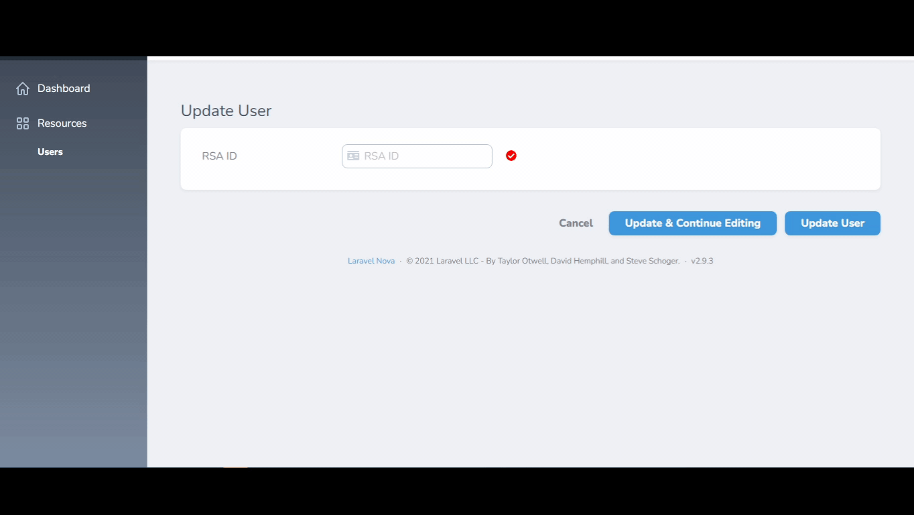

# RSA Id Nova Field

[](https://packagist.org/packages/haythem/rsa-id-nova-field)
[](https://packagist.org/packages/haythem/rsa-id-nova-field)

Package Description: A Laravel Nova field for RSA IdNumber Validation




## Installation

Install via composer
```bash
composer require haythem/rsa-id-nova-field
```

## Usage

```php
    use Haythem\RsaIdNovaField\RsaIdNovaField;
    
    public function fields(Request $request)
    {
     return [
       RsaIdNovaField::make("RSA ID")
            ->acceptFullIdOnly(false)
            ->acceptValidIdOnly(true) // add an extra validation rule
            ->showValidationIcon(true)
            ->showBirthDay(true)
            ->showGenderIcon(true)
            ->showCitizenship(true)
            ->showAge(true)
            ->storeAge("age")
            ->storeGender("gender")

            /**
            *    Store the birthday on a given field and a specific date format
            *
            *
            *    d Day of the month as digits; no leading zero for single-digit days.
            *    dd	Day of the month as digits; leading zero for single-digit days.
            *    ddd	Day of the week as a three-letter abbreviation.
            *    DDD	"Ysd", "Tdy" or "Tmw" if date lies within these three days. Else fall back to ddd.
            *    dddd	Day of the week as its full name.
            *    DDDD	"Yesterday", "Today" or "Tomorrow" if date lies within these three days. Else fall back to dddd.
            *    m	Month as digits; no leading zero for single-digit months.
            *    mm	Month as digits; leading zero for single-digit months.
            *    mmm	Month as a three-letter abbreviation.
            *    mmmm	Month as its full name.
            *    yy	Year as last two digits; leading zero for years less than 10.
            *    yyyy	Year represented by four digits.
            *    shortDate	m/d/yy	6/9/07
            *    paddedShortDate	mm/dd/yyyy	06/09/2007
            *    mediumDate	mmm d, yyyy	Jun 9, 2007
            *    longDate	mmmm d, yyyy	June 9, 2007
            *    fullDate	dddd, mmmm d, yyyy	Saturday, June 9, 2007
            */   
            ->storeBirthday("birthday","yyyy/mm/dd")

    ];
    }

```
